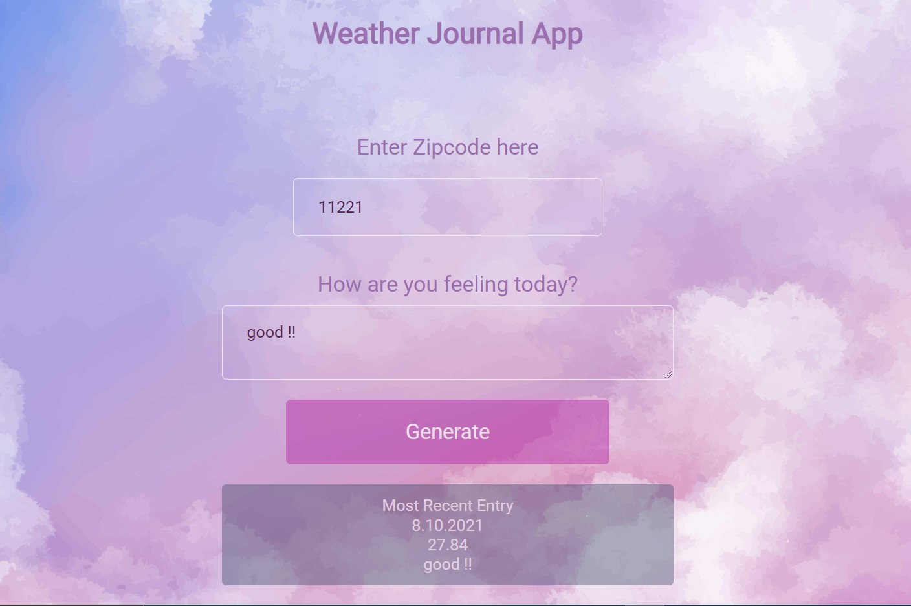

# Weather-Journal App Project

## Author
Sherif Elkady

## Overview

This project requires you to create an asynchronous web app that uses Web API and user data to dynamically update the UI. 

## Instructions
This will require modifying the `server.js` file and the `website/app.js` file. You can see `index.html` for element references, and once you are finished with the project steps, you can use `style.css` to style your application to customized perfection.

##  Environment setup

In this project we are using Node and Express environemnts. Node and Express should be installed on the local machine

## Project Dependencies Dependencies
- Cors package
- body-parser
- Express